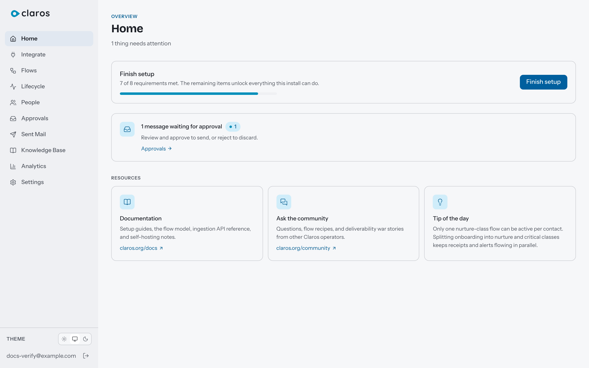
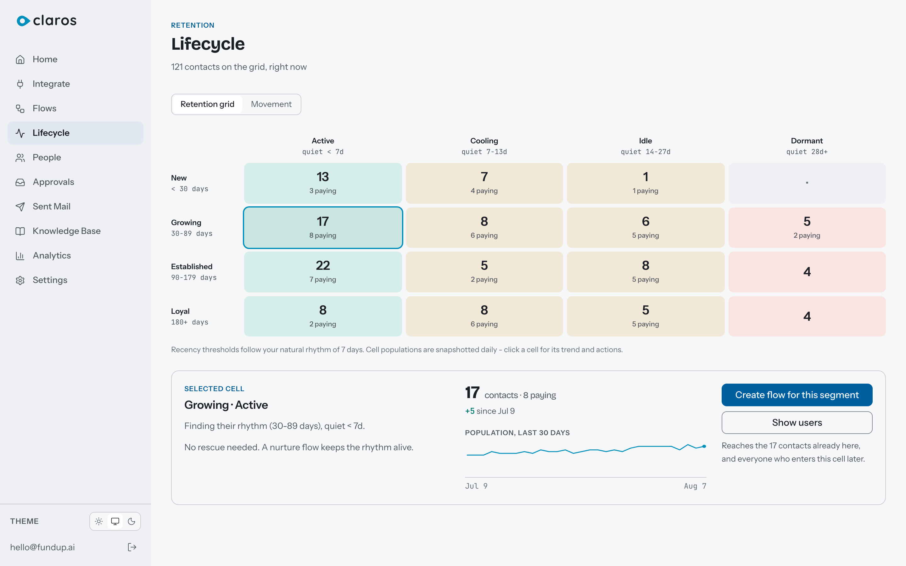

# Mailforge

**The open-source lifecycle email engine.** Your data, your transport, your LLM.

An AI-native alternative to Customer.io, Loops, and Mautic. Flows are written in plain language, compiled once by an LLM into a deterministic execution plan, and run by a pure Postgres-backed engine. No Redis, no Kafka, no message broker. One Docker image, one database.

[](https://github.com/sasbaws2211-cloud/mailforge/actions/workflows/ci.yml)
[](./LICENSE)



## Why it is different

**Flows are prompts, compiled once.** There is no drag-and-drop builder. You describe the flow ("welcome them, nudge them if they have not activated in 2 days, stop when they do"), the LLM compiles it into an inspectable plan, and the engine executes that plan deterministically. The AI never touches timing, targeting, or the send path.

**Everything AI-written waits for a human.** Generated emails queue in an approval inbox. You approve, reject, or let a trusted flow auto-send. The AI drafts; you publish.


**Your stack, your keys.** Emails go through your Resend or SMTP account. AI runs against your OpenAI-compatible endpoint (OpenAI, Anthropic, Gemini, Groq, Ollama). Postgres is the only infrastructure. Nothing phones home.

**A retention grid, not a vanity dashboard.** Contacts are bucketed by tenure and recency into a 4x4 grid. Each cell is an audience you can act on: create a flow, see who is there, watch the trend. The grid adapts to your product's natural rhythm.



## Get running

```bash
git clone https://github.com/sasbaws2211-cloud/mailforge.git && cd mailforge
docker compose run --rm install
docker compose up
```

Open the claim URL printed to the console, enter your email, and you are the owner. The **[Quickstart](guide/QUICKSTART.md)** walks through the rest: connect a transport, activate the library flow, send a test event, and receive a real email - all from the browser. About 5 minutes once images are cached.

## What it does

- **Lifecycle state machine** - 7 contact states (`signed_up` through `resurrected`) with engagement depth scoring and a payment overlay. Event-driven and time-driven transitions
- **Prompt-defined flows** - compiled to deterministic plans. Triggers: events, lifecycle transitions, retention-grid segments. Steps with delays, conditions, send windows, exit conditions
- **Brain** - compile, decide, draft, assess. Real LLM calls to any OpenAI-compatible endpoint, only at compile time and content time, never in the execution path
- **Approval queue** - AI-drafted messages are held for human review by default; per-flow auto-approve when you trust it
- **Event ingestion** - Segment-compatible `/v1/track`, `/v1/identify`, `/v1/batch`. Publishable and secret API keys, rate limits, browser snippet at `/mailforge.js`
- **Transports** - Resend (with open/click/bounce webhooks) and generic SMTP (including the Amazon SES SMTP endpoint)
- **Compliance built in** - RFC 8058 one-click unsubscribe and a CAN-SPAM postal footer on every outgoing email, suppression list enforced before everything
- **Throttle and send windows** - per-contact frequency caps, quiet hours, per-flow critical bypass
- **Knowledge base** - pgvector-backed entries injected into compile and draft prompts
- **Dashboard** - React SPA: Flows, Approvals, People, Lifecycle, Analytics, Knowledge Base, Settings, Integrate. Light and dark themes
- **Operator CLI** - guided setup, login links, transport/LLM configuration, user recovery, deployment diagnostics

### Not yet built

- Schedule/cron triggers and manual-trigger enrollment (flows enroll on events, lifecycle transitions, and retention-grid segments today)
- SES API-mode transport and non-Resend feedback webhooks (SES works today through its SMTP endpoint)
- Knowledge base file upload and site crawl
- Anonymous identity stitching (contacts key on `userId` today)
- Multiple workspaces per self-hosted instance

## Documentation

| Document | What it covers |
|---|---|
| [Quickstart](guide/QUICKSTART.md) | Three commands to a running install, then a real email via the browser |
| [Installation and Configuration](guide/INSTALLATION.md) | Every run mode, every environment variable and setting, migrations, upgrading, backups |
| [Deployment](guide/DEPLOYMENT.md) | External Postgres, multiple instances, the role split, secrets that must match |
| [Concepts and Guides](guide/CONCEPTS.md) | The model: events, contacts, compilation, approvals, content modes. Task guides |
| [Flow Prompt Library](guide/FLOW-PROMPTS.md) | Working prompts to paste into the flow editor |
| [Ingestion](guide/INGESTION.md) | Sending events: curl, browser snippet, server SDKs, Segment compatibility, GTM |
| [FAQ and Troubleshooting](guide/FAQ.md) | Lost admin access, secrets, email not sending, AI features idle, backups, data egress |
| [Contributing](CONTRIBUTING.md) | The development model (open source, not open contribution) |
| [Security](SECURITY.md) | Vulnerability reporting |

Changes are documented on the [releases page](https://github.com/sasbaws2211-cloud/mailforge/releases); there is no separate changelog file.

## Editions

Both editions share the same engine and schema. The distinction is how the product is operated.

| | Community (this repo, MIT) | Cloud |
|---|---|---|
| **Engine** | Full lifecycle engine, all workers | Same engine |
| **Brain** | BYO LLM key (OpenAI-compatible or local/Ollama) | Same at launch; optimized hosted prompts later |
| **Transport** | Resend, SMTP (bring your own) | + Zero-config hosted sending |
| **Compliance** | RFC 8058 one-click unsub, suppression, CAN-SPAM | Same + managed deliverability |
| **Deploy** | Self-host: single image, Postgres only | Fully hosted, zero-ops |
| **Cost** | Free (MIT) | Pay per email sent |

Cloud adds zero-ops hosting and managed sending, not a better engine. The engine is identical.

## Development (from source)

Requires Node.js 22+, pnpm 9.15+, and Postgres 16 with pgvector.

```bash
pnpm install
pnpm db:migrate   # apply migrations to DATABASE_URL from .env
pnpm dev          # API on :3000 (watch mode), dashboard dev server on :5173
```

Details and the production image are in [Installation and Configuration](guide/INSTALLATION.md).

## License

MIT - see [LICENSE](./LICENSE). Bug reports welcome in [GitHub Issues](https://github.com/sasbaws2211-cloud/mailforge/issues).
