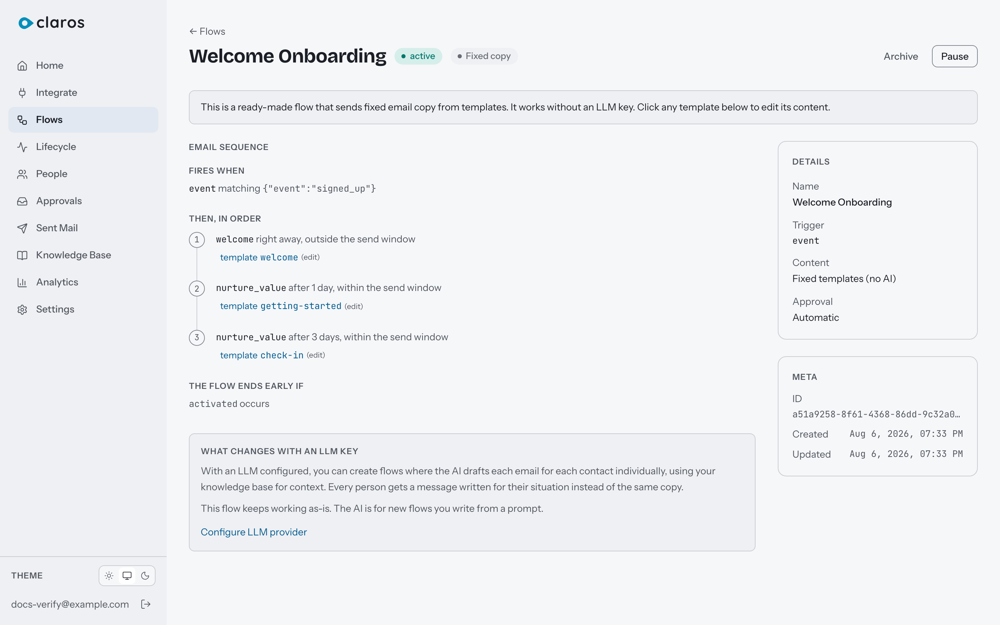
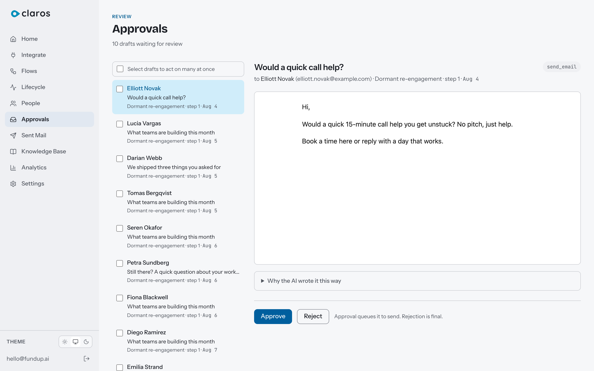

# Concepts and Guides

Mailforge is unconventional in one deliberate way: there is no visual flow builder. Flows are written as plain-language prompts, compiled once into a deterministic plan, and executed by an engine that never calls an AI. This page explains that model, then gives short guides for the tasks people actually try first.

Contents:

- [The mental model](#the-mental-model)
- [How an event becomes an email](#how-an-event-becomes-an-email)
- [Compilation: prompts in, deterministic plans out](#compilation-prompts-in-deterministic-plans-out)
- [The approval queue](#the-approval-queue)
- [Three ways to produce email content](#three-ways-to-produce-email-content)
- [Flow mechanics](#flow-mechanics) (triggers, classes, re-entry, windows)
- [Guides](#guides)

---

## The mental model

Four objects, one direction:

```
Event  ->  Contact  ->  Flow membership  ->  Message
(track/identify)  (one per userId)  (compiled plan executes)  (one email)
```

- **Events** arrive through the ingestion API (`/v1/track`, `/v1/identify`, `/v1/batch`, Segment-compatible). See [INGESTION.md](./INGESTION.md).
- **Contacts** are the people. One contact per `userId` (stored as `external_id`). Email addresses are optional and unique when present. Every contact has a lifecycle state (`signed_up`, `activated`, `engaged`, `at_risk`, `dormant`, `churned`, `resurrected`) that the engine maintains from their activity.
- **Flows** are the automations. A flow has a trigger, a compiled plan of steps, and policies. When a contact matches a trigger, the engine enrolls them: they become a flow membership.
- **Messages** are individual emails. Each step a membership reaches creates exactly one message, which is generated, optionally approved, and sent.

The engine is deterministic. Everything below the flow is Postgres jobs and SQL. AI participates in exactly two places, both off the execution path: compiling a flow's prompt into its plan, and drafting a message's copy before it enters the approval queue.

## How an event becomes an email

Using the quickstart path as the example (`signed_up` event, welcome flow active):

1. `POST /v1/track` stores the event and resolves the contact (find-or-create by `userId`). Identifying first with `traits.email` gives the contact an address; without one, messages cannot be sent to them.
2. Ingestion immediately queues a trigger check. Active, compiled flows whose trigger matches the event enroll the contact. Guards run here: suppression list first, then the one-active-nurture-flow rule, then the re-entry policy.
3. The membership advances to step 1. Its delay (`0m` for the welcome email) has already elapsed, so a message is created.
4. Content generation produces the copy. For the library flow this is instant (fixed templates); for AI-drafted flows the brain decides whether to send, drafts, and scores the draft for value.
5. The message lands in the approval queue, or skips it if the flow's approval mode is `auto`.
6. The drain worker picks up approved messages, checks compliance gates (postal address set, signing key present, production URL sane) and the throttle (suppression, frequency caps, send window), injects one-click unsubscribe headers and the postal footer, and hands the message to your transport.
7. With Resend, opens, clicks, bounces, and complaints come back through the webhook and appear on the message and contact. Feedback only moves forward (`sent` → `opened` → `clicked`), never backward.

**Timing you should expect.** On the happy path this takes seconds: workers poll every 2 seconds and each stage hands off to the next. AI-drafted content adds LLM latency (three calls, typically seconds to a minute). Steps with delays wait for the delay, re-checked on the 15-minute scan. Lifecycle-transition and segment triggers are evaluated on the same 15-minute scan, so they can lag an event by up to 15 minutes. If a queued job is ever lost, 15-minute sweeps catch everything; the worst case from event to send is roughly 35 minutes.

## Compilation: prompts in, deterministic plans out

A prompt-defined flow starts as plain language:

> When a user signs up, send a welcome email immediately. If they have not activated after 2 days, send a getting-started guide. After 5 days, send a case study. Exit the flow as soon as they activate.

Pressing **Compile** sends the prompt to your configured LLM exactly once. The result is a JSON execution plan: an ordered list of steps with delays, conditions, send-window policies, and exit conditions, validated against a strict schema before it is stored. If the model produces something invalid, compilation fails safely and nothing changes.

From then on the plan, not the prompt, is what runs. The engine reads it with SQL. The same prompt compiled twice produces equivalent plans, and the plan is inspectable in the flow editor, so there are no surprises at send time.



Recompiling happens only when you ask (prompt changed, or a membership froze on an unrecognized condition). Editing a flow's prompt does nothing until you compile it again.

Rules that follow from this design:

- Compilation and AI drafting need an LLM provider configured. Everything else does not.
- The LLM never decides timing at send time. Delays, windows, and throttles are computed by the engine.
- Conditions are a closed vocabulary: current lifecycle state is / is not X, and event Y has / has not happened since this step. Plans cannot contain arbitrary predicates.

## The approval queue

AI-drafted flows default to `approval_mode: require`: every generated message waits in **Approvals** until a human approves or rejects it. This is the trust mechanism. The AI writes, you publish.



- Approve sends within seconds; reject discards permanently. Bulk approve/reject handles up to 100 at a time.
- Unapproved messages wait forever. Nothing auto-sends, nothing expires.
- Fixed-content flows default to `auto` because a human already wrote the copy.
- Approval mode is per flow. A common pattern: `require` while a flow is new, switch to `auto` once you trust its output.
- Messages that fail generation land in `failed` with the reason attached, and can be retried from the queue.

## Three ways to produce email content

1. **AI-drafted** (`ai_drafted`). Each step carries an instruction for the drafter. Per contact per step, the brain runs decide (send, wait, or skip), draft (write the email), and assess (is this worth sending; if not, the message is value-gated and dies quietly). Personalization comes from the contact's events, traits, lifecycle state, and your knowledge base entries. Requires an LLM provider.
2. **Human-written** (`fixed_content`). You write the subject and body for each step in the flow editor; they are stored as templates with variable interpolation. No LLM involved at any point. This is how the library flow works, and it is the recommended way to get comfortable before turning on AI drafting.
3. **AI-assisted human copy**. While editing a fixed-content step, you can ask the AI for a draft of that step, edit it, and save it as your own. The AI contributes once, at writing time; the result is ordinary fixed content. Requires an LLM provider.

You can mix approaches across flows, and reference your own templates (`@template:name`) and knowledge base entries (`@kb:name`) inside prompts.

## Flow mechanics

**Triggers.** Four types, three of which enroll today:

| Trigger | Config | Enrolls |
|---|---|---|
| `event` | an event name, e.g. `signed_up` | Yes, near-instant. Only `track` calls trigger flows; `identify` does not |
| `lifecycle_transition` | from-state, to-state | Yes, on the 15-minute scan |
| `segment` | one cell of the retention grid (tenure bucket x recency bucket) | Yes, on the 15-minute scan, capped at 200 enrollments per flow per scan |
| `manual` | - | Accepted by the API but not wired to enrollment yet |

There is no general-purpose segment builder. "Segment" means exactly one cell of the retention grid: tenure (`new`, `growing`, `established`, `loyal`) crossed with recency (`active`, `cooling`, `idle`, `dormant`). The grid you see in Analytics is the same set a segment-triggered flow enrolls.

**Classes.** Every flow is `nurture` or `critical`. A contact can be in at most one active nurture flow at a time; a higher-priority flow evicts the current one. Critical flows (dunning, limits) have no concurrency limit and bypass the frequency caps and send window. Nothing bypasses the suppression list.

**Re-entry.** Per flow: `once`, `cooldown` (default 30 days), or `every_time`. Enforced by a uniqueness constraint on active memberships, so races cannot double-enroll.

**Send windows.** Each step is `immediate` (welcome, dunning: ignores the send window) or `respect_window` (waits for 09:00-17:00 weekdays, or whatever you configure). Frequency caps (1/day, 2/week, 48h gap by default) apply to everything except critical flows.

---

## Guides

### Write your first prompt-defined flow

1. Configure an LLM provider (Settings → LLM, or `mailforge llm set`). Without one, use fixed content instead: steps 2-4 still work, you just skip compilation and write each step's copy yourself.
2. Flows → New flow. Choose the trigger (an event name your app sends, a lifecycle transition, or a retention-grid cell) and write the prompt. [FLOW-PROMPTS.md](./FLOW-PROMPTS.md) has working starting points.
3. Compile. Read the generated plan in the editor; check the delays, conditions, and exit conditions match your intent. Fix the prompt, recompile.
4. Activate the flow. New matching contacts enroll from that moment.
5. Watch **Approvals** for the first messages. Approve a few, and switch the flow to auto-approve when you trust it.

Verify it works by firing the trigger at yourself, exactly like steps 9-11 of [QUICKSTART.md](./QUICKSTART.md).

### Set up open and click tracking (Resend only)

1. Save your Resend transport first; note your tenant ID (see [INSTALLATION.md](./INSTALLATION.md#email-transport)).
2. In the Resend dashboard, create a webhook pointing at `https://<your-host>/webhooks/resend/<tenantId>` and subscribe to the `email.*` events.
3. Copy the webhook's signing secret into your transport config (`webhook_secret` field, Settings → Transport or `mailforge transport set`).
4. Opens, clicks, bounces, and complaints now appear on messages and contacts. Permanent bounces and complaints also add the address to your suppression list automatically.

SMTP transports have no feedback channel; there is nothing to configure.

### Import a suppression list from your old provider

Settings → Sent → Suppressions → Import, paste one address per line (up to 10,000). Or:

```bash
curl -X POST http://localhost:3000/v1/suppressions/import \
  -H "Cookie: mailforge_session=<your-session>" \
  -H "Content-Type: application/json" \
  -d '{"addresses":["old-unsub-1@example.com","old-unsub-2@example.com"]}'
```

Suppressed addresses are blocked at enrollment and again at send, for every flow including critical ones. Transactional auth email (login links, invites) is the only exception.

### Apply a business model template

If your product is a freemium, time-limited trial, or preview-free SaaS, applying the matching template (offered during first-run setup, or via the API) seeds sensible lifecycle tuning, throttle settings, and a set of draft flows with pre-written prompts for your model. The flows arrive as drafts: review their prompts, compile, and activate the ones you want. Templates can be applied once per workspace.

---

Next: [FLOW-PROMPTS.md](./FLOW-PROMPTS.md) for a library of working flow prompts, [FAQ.md](./FAQ.md) for troubleshooting.
